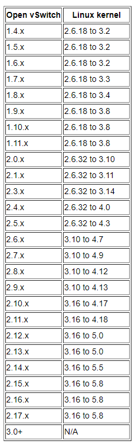
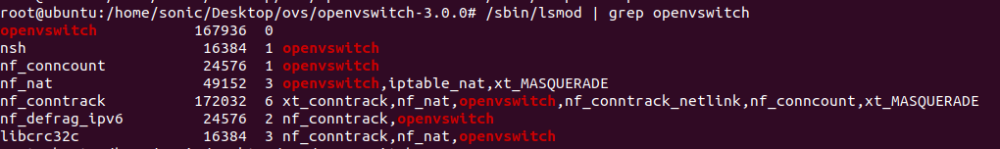
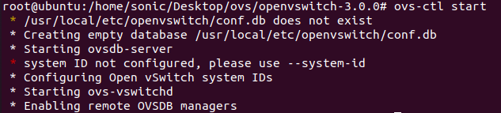
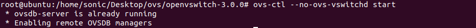
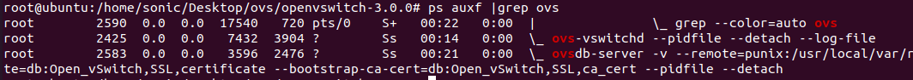
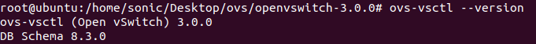
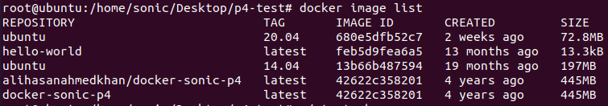
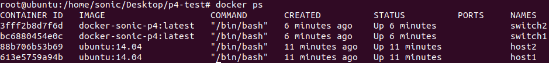
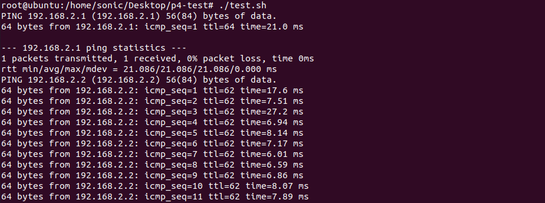

# sonic安装步骤

他的官方安装的链接地址在这里：https://github.com/sonic-net/SONiC/wiki/SONiC-P4-Software-Switch

记得先下载下来他的`SONiC-P4.Test.tar.gz`，然后传进虚拟机，解压缩之后，可以看见五个`.sh`文件和两个文件夹，之后进行下面文档的步骤。

------

### 安装docker与ovs

**推荐使用ubuntu20.04或者是ubuntu14.04，不要使用ubuntu22.04（怎么装都老是出错）**

本来安装`docker`和`ovs`都是他给的文件`install_docker_ovs.sh`里的步骤，但是因为网络的问题，会卡在`apt.dockerproject.org`的联通问题上，就会造成一直的无法安装，所以进行了手动的对这两个进行安装。

------

#### 安装docker

首先对apt进行缓存更新

```shell
$ sudo apt-get update
```

之后安装一些支持

```shell
$ sudo apt-get install \
    apt-transport-https \
    ca-certificates \
    curl \
    gnupg \
    lsb-release
```

**替换安装源**

因为国内的网络问题会造成一直的无法连接网络的情况，建议替换软件源。一般可以替换阿里云的或者是清华的源，我这里用的是阿里云的源。

首先需要添加软件源的`GPG`

```shell
$ curl -fsSL https://mirrors.aliyun.com/docker-ce/linux/ubuntu/gpg | sudo gpg --dearmor -o /usr/share/keyrings/docker-archive-keyring.gpg
```

之后向`sources.list` 中添加 Docker 软件源

```shell
$ echo \
  "deb [arch=amd64 signed-by=/usr/share/keyrings/docker-archive-keyring.gpg] https://mirrors.aliyun.com/docker-ce/linux/ubuntu \
  $(lsb_release -cs) stable" | sudo tee /etc/apt/sources.list.d/docker.list > /dev/null
```

**安装docker**

首先更新apt，然后安装`docker-ce`

```shell
$ sudo apt-get update
$ sudo apt-get install docker-ce docker-ce-cli containerd.io
```

**（或者使用脚本自动进行一键安装操作）**

```shell
$ curl -fsSL get.docker.com -o get-docker.sh
$ sudo sh get-docker.sh --mirror Aliyun
```

**试着启动docker**

```shell
$ sudo systemctl enable docker
$ sudo systemctl start docker
```

**建立docker用户组（可选）**

一般情况下Docker只有`root`用户和`docker`组用户可以访问Docker的引擎`Unix socket`。所以可以添加`docker`用户组来进行访问。或者说就只使用`root`用户进行访问操作（我是这种，因为可以少去`sudo`命令）

建立`docker`组

```shell
$ sudo groupadd docker
```

将当前用户加入 `docker` 组：

```shell
$ sudo usermod -aG docker $用户
```

退出当前终端并重新登录，进行如下测试。

**测试docker是否安装成功**

```shell
$ docker run --rm hello-world

Unable to find image 'hello-world:latest' locally
latest: Pulling from library/hello-world
b8dfde127a29: Pull complete
Digest: sha256:308866a43596e83578c7dfa15e27a73011bdd402185a84c5cd7f32a88b501a24
Status: Downloaded newer image for hello-world:latest

Hello from Docker!
This message shows that your installation appears to be working correctly.

To generate this message, Docker took the following steps:
 1. The Docker client contacted the Docker daemon.
 2. The Docker daemon pulled the "hello-world" image from the Docker Hub.
    (amd64)
 3. The Docker daemon created a new container from that image which runs the
    executable that produces the output you are currently reading.
 4. The Docker daemon streamed that output to the Docker client, which sent it
    to your terminal.

To try something more ambitious, you can run an Ubuntu container with:
 $ docker run -it ubuntu bash

Share images, automate workflows, and more with a free Docker ID:
 https://hub.docker.com/

For more examples and ideas, visit:
 https://docs.docker.com/get-started/
```

当输出以下内容的时候，就说明安装好了。

**ps:** 如果出现这样

```shell
$ docker run --rm hello-world
docker: Got permission denied while trying to connect to the Docker daemon socket at unix:///var/run/docker.sock: Post "http://%2Fvar%2Frun%2Fdocker.sock/v1.24/containers/create": dial unix /var/run/docker.sock: connect: permission denied.
See 'docker run --help'.
```

说明上面的用户组出错。可以尝试登录root用户进行试试。

或者这种情况

```shell
$ docker run --rm hello-world
Unable to find image 'hello-world:latest' locally
docker: Error response from daemon: Get "https://registry-1.docker.io/v2/library/hello-world/manifests/sha256:faa03e786c97f07ef34423fccceeec2398ec8a5759259f94d99078f264e9d7af": dial tcp 3.216.34.172:443: i/o timeout.
See 'docker run --help'.
```

是因为网络问题，再次输入`$ docker run --rm hello-world`进行尝试。

docker有一个很全面的介绍网站 https://yeasy.gitbook.io/docker_practice/，基本遇到的问题都能在这里解决。

------

#### **安装ovs**

ovs的官网安装指导文档https://docs.openvswitch.org/en/latest/intro/install/general/

**下载与安装步骤**

更新`apt`缓存

```shell
$ sudo apt-get update
```

首先安装几个部件，确保后续不会出问题

```shell
$ sudo apt-get install build-essential
$ sudo apt-get install openssl
$ sudo apt-get install python
$ sudo apt-get install python3-pip
```

可以使用`uname -a`，命令查看当前的linux的内核版本

```shell
$ sudo uname -a
```

然后根据自己的内核挑选合适的版本，如果linux内核是5.8+的，那么用ovs-3.0+的就可以。



OVS对应版本的下载的网页在这个位置https://www.openvswitch.org/download/

使用`wegt`下载数据包，或者在网页下载好之后使用`lrzsz`传进来

```shell
$ sudo wegt https://www.openvswitch.org/releases/openvswitch-3.0.0.tar.gz
```

对包进行解压缩，之后`cd`进来

```shell
$ sudo tar -xzf openvswitch-3.0.0.tar.gz
$ sudo cd openvswitch-3.0.0
```

查看你当前的内核源码的编译目录

```shell
$ sudo /lib/modules
```

根据你的你的内核源码目录进行执行命令

```shell
$ sudo ./configure --with-linux=/lib/modules/5.15.0-46-generic(你自己对应的目录，我这里的就是5.15.0-46-generic）/build
```

命令执行过后，执行命令进行安装操作，安装的时间挺长，注意各种错误提示。

```shell
$ sudo make&&make install
```

如果在安装的过程中生成了修改了内核模块，那么需要重新编译内核，输入命令

```shell
$ sudo make modules_install
```

**OVS部署配置**

需要载入模块，载入`openvswitch`模块到内核中，输入命令

```shell
$ sudo /sbin/modprobe openvswitch
$ sudo /sbin/lsmod | grep openvswitch
```



**PS:**这种情况就是加载进去了。

启动OVS，首先输入下面代码，导入环境变量。然后执行命令`ovs-ctl start`启动

```shell
$ sudo export PATH=$PATH:/usr/local/share/openvswitch/scripts
$ sudo ovs-ctl start
```

当出现下面这种，即成功。



启动ovsdb-server服务，首先执行命令：`export PATH=$PATH:/usr/local/share/openvswitch/scripts`导入环境变量，然后执行命令：`ovs-ctl --no-ovs-vswitchd start`。

```shell
$ sudo export PATH=$PATH:/usr/local/share/openvswitch/scripts
$ sudo ovs-ctl --no-ovs-vswitchd start
```

执行完成后，如下图所示即代表`ovsdb-server`服务启动成功。



建立Open vSwitch配置文件和数据库，并根据ovsdb模板创建ovsdb数据库，用于存储虚拟交换机的配置信息。

依次执行下面的命令

```shell
$ sudo mkdir -p /usr/local/etc/openvswitch
$ sudo ovsdb-tool create /usr/local/etc/openvswitch/conf.db vswitchd/vswitch.ovsschema  2>/dev/null
```

如果没有报错的话OVS的部署已经成功完成。如果中间步骤出现问题，检查一下单词拼写错误。

**启动OVS**

在启动OVS之前，我们需要先启动`ovsdb-server`配置数据库。注意后面的命令大部分是由两个短“-”组成的。

```shell
$ sudo ovsdb-server -v --remote=punix:/usr/local/var/run/openvswitch/db.sock --remote=db:Open_vSwitch,Open_vSwitch,manager_options --private-key=db:Open_vSwitch,SSL,private_key --certificate=db:Open_vSwitch,SSL,certificate --bootstrap-ca-cert=db:Open_vSwitch,SSL,ca_cert --pidfile --detach
```

首次用`ovsdb-tool`创建数据库时需用`ovs-vsctl`命令初始化下数据库。

```shell
$ sudo ovs-vsctl --no-wait init
```

启动OVS主进程

```shell
$ sudo ovs-vswitchd --pidfile --detach
```

查看OVS进程是否启动。

```shell
$ sudo ps auxf |grep ovs
```



通过如下命令查看所安装OVS的版本号。

```shell
$ sudo ovs-vsctl --version
```



这样就算安装好OVS了。

#### ps:当后续ovs出现连接不上数据库的情况，可能是数据库没有启动

```shell
$ sudo !/bin/bash 
ovsdb-server --remote=punix:/usr/local/var/run/openvswitch/db.sock \
                     --remote=db:Open_vSwitch,Open_vSwitch,manager_options \
                     --private-key=db:Open_vSwitch,SSL,private_key \
                     --certificate=db:Open_vSwitch,SSL,certificate \
                     --bootstrap-ca-cert=db:Open_vSwitch,SSL,ca_cert \
                     --pidfile --detach
$ sudo ovs-vsctl --no-wait init
$ sudo ovs-vswitchd --pidfile --detach
```

------

### 进行`load_image.sh`里的操作

在`load_image.sh`中他的代码为

```shell
wget https://sonic-jenkins.westus2.cloudapp.azure.com/job/p4/job/buildimage-p4-all/543/artifact/target/docker-sonic-p4.gz
sudo docker load < docker-sonic-p4.gz
```

但是这个`docker-sonic-p4.gz`包docker已经不再支持下载，所以这个`wget`操作是没办法把包下载下来的。

但是其官方仓库（https://hub.docker.com/r/alihasanahmedkhan/docker-sonic-p4）里面还是有这个包的，所以可以直接使用下面命令把包下载下来。

```shell
$ sudo docker pull alihasanahmedkhan/docker-sonic-p4
```

同时为了后续方便，顺便下载下来ubuntu的镜像

```shell
$ sudo docker pull ubuntu:14.04
```

他这个14.04版本号不用在意，只要你的ubuntu的版本号比这个高就好，直接输入命令即可。

------

### 运行`./start.sh`

这个时候出现一个问题，我们上面下载下来的包名是`alihasanahmedkhan/docker-sonic-p4`，但是`start.sh`文件中使用的是`docker-sonic-p4`，所以我们需要对他进行改名

```shell
$ sudo docker tag alihasanahmedkhan/docker-sonic-p4 docker-sonic-p4:latest
```

然后使用`docker image list`命令查看是否改成了想要的image

```shell
$ sudo docker image list
```



之后在解压缩后的p4-test文件夹中运行`start.sh`文件

```shell
$ sudo ./start.sh
```

运行成功之后输入命令查看容器是否已启动

```shell
$ sudo docker ps
```



稍等一段时间之后，运行`test.sh`测试host1与host2的连通性

```shell 
$ sudo ./test.sh
```



之后使用`./stop.sh`结束仿真

```shell
$ sudo ./stop.sh
```

### **至此sonic安装完成**


### SONIC-P4配置详情

------

再start.sh中，我们已经将配置文件夹挂载到交换机容器中，位于`/对应的交换机名称文件夹`。最重要的配置`/sonic/scripts/startup.sh`、`/sonic/etc/config_db/vlan_config.json`和`/sonic/etc/quagga/bgpd.conf`。

在`/sonic/scripts/startup.sh`中，启动了所有 SONiC 服务和一个 P4 软件开关。P4软件开关由这一行启动（见supervisord.conf）

```shell
simple_switch --log-console -i 1@eth1 -i 2@eth2 ...
```

它将接口 eth1 绑定到 P4 软件交换机的端口 1，eth2 绑定到端口 2，依此类推。这些 ethX 接口通常被称为*前面板接口*，并直接被 P4 交换机用于承载数据平面数据包。然而，SONiC 在另一种类型的接口上运行，称为*主机接口*。*主机接口*用于 SONiC 控制平面，不承载数据平面数据包。*主机接口*命名为 EthernetX 。我们在主机接口上配置对等 IP 和 MTU。SONiC 从*主机接口*读取 IP 和 MTU 等配置，然后使用 SAI 在 P4 软件交换机上配置这些值。*主机接口*之间的映射和交换机端口指定在`/port_config.ini`：

```shell
# alias         lanes
Ethernet0       1
Ethernet1       2
...
```

连同 中的 simple_switch 命令`/sonic/scripts/startup.sh`，我们配置了这个映射 Ethernet0 --> lane 1 --> eth1。它本质上是*主机接口*和*前面板接口*之间的映射。

`/sonic/etc/config_db/vlan_config.json`配置本次测试使用的switch vlan接口，使用ConfigDB接口，详见[这里：](https://github.com/Azure/SONiC/wiki/Configuration)

```shell
{
    "VLAN": {
        "Vlan15": {
            "members": [
                "Ethernet0"
            ], 
            "vlanid": "15"
        }, 
        "Vlan10": {
            "members": [
                "Ethernet1"
            ], 
            "vlanid": "10"
        }
    },
    "VLAN_MEMBER": {
        "Vlan15|Ethernet0": {
            "tagging_mode": "untagged"
        },
        "Vlan10|Ethernet1": {
            "tagging_mode": "untagged"
        }
    },
    "VLAN_INTERFACE": {
        "Vlan15|10.0.0.0/31": {},
        "Vlan10|192.168.1.1/24": {}
    }
}
```

`/sonic/etc/quagga/bgpd.conf`在交换机上配置 BGP 会话。这是 switch1 的 BGP 配置，它使用对等 IP 10.0.0.0/31 与 switch2 对等，并宣布 192.168.1.0/24。

```shell
router bgp 10001                        
  bgp router-id 192.168.1.1             
  network 192.168.1.0 mask 255.255.255.0
  neighbor 10.0.0.1 remote-as 10002     
  neighbor 10.0.0.1 timers 1 3          
  neighbor 10.0.0.1 send-community      
  neighbor 10.0.0.1 allowas-in          
  maximum-paths 64                      
!                                       
access-list all permit any
```
